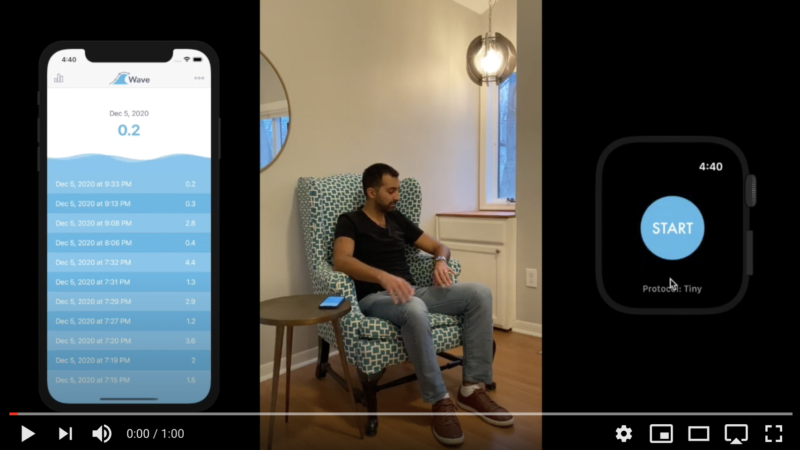

# Wave: Hydration Check

Wave helps you stay healthy & hydrated. Use your Apple Watch to assess your hydration status.

## About
Using Wave your watch will measure the difference between your resting (sitting/laying) heart rate and your stressed (standing) heart rate. This difference is known as orthostatic heart rate change, which can be used to assess your hydration status. Simply open the app on your watch and press start to begin, follow the on screen prompt, it will tap you when it is time to change positions and when the reading is complete.
### Intro Video

## Testflight Beta
Once approved for beta testing by Apple, a public download link will be available here.

## Privacy
Privacy policy in a nutshell: we want your data to stay as safe as possible, thus it stays on your device, and you get to pick if/when it leaves the app.
[Privacy Policy](Privacy_Policy.md)

## FAQ
Please see our [FAQ page](FAQ.md) for any questions you may have.

## Support
Please email [eotles@gmail.com] with any support issues.

This is a website for the Wave iOS project.
